# bmtool
A collection of modules to make developing [Neuron](https://www.neuron.yale.edu/neuron/) and [BMTK](https://alleninstitute.github.io/bmtk/) models easier.

[](https://github.com/cyneuro/bmtool/blob/master/LICENSE) 

## Table of Contents
- [Getting Started](#Getting-Started)
- [CLI](#CLI)
- [Single Cell](#Single-Cell-Module)
- [Connectors](#Connectors-Module)
- [Bmplot](#bmplot-Module)
- [Graphs](#graphs-module)

## Getting Started

**Installation**
```bash
pip install bmtool
```
For developers who will be pulling down additional updates to this repository regularly use the following instead.
```bash
git clone https://github.com/cyneuro/bmtool.git
cd bmtool
python setup.py develop
```
Then download updates (from this directory) with
```bash
git pull
```

## CLI
#### Many of modules available can be accesed using the command line 
```bash
> cd your_bmtk_model_directory
> bmtool
Usage: bmtool [OPTIONS] COMMAND [ARGS]...

Options:
  --verbose  Verbose printing
  --help     Show this message and exit.

Commands:
  debug
  plot
  util

>  
> bmtool plot 
Usage: bmtool plot [OPTIONS] COMMAND [ARGS]...

Options:
  --config PATH  Configuration file to use, default: "simulation_config.json"
  --no-display   When set there will be no plot displayed, useful for saving
                 plots
  --help         Show this message and exit.

Commands:
  connection  Display information related to neuron connections
  positions   Plot cell positions for a given set of populations
  raster      Plot the spike raster for a given population
  report      Plot the specified report using BMTK's default report plotter
>
```

## Single Cell Module
- [Passive properties](#passive-properties)
- [Current injection](#current-clamp)
- [FI curve](#fi-curve)
- [ZAP](#zap)
- [Tuner](#single-cell-tuning)
- [VHalf Segregation](#vhalf-segregation-module)
#### The single cell module can take any neuron HOC object and calculate passive properties, run a current clamp, calculate FI curve, or run a ZAP. The module is designed to work with HOC template files and can also turn Allen database SWC and json files into HOC objects and use those. The examples below uses "Cell_Cf" which is the name of a HOC templated loaded by the profiler.

#### First step is it initialize the profiler.


```python
from bmtool.singlecell import Profiler
profiler = Profiler(template_dir='templates', mechanism_dir = 'mechanisms', dt=0.1)
```

#### Can provide any single cell module with either name of Hoc template or a HOC object. If you are wanted to use Allen database SWC and json files you can use the following function


```python
from bmtool.singlecell import load_allen_database_cells
cell = load_allen_database_cells(path_to_SWC_file,path_to_json_file)
```

### Passive properties
#### Calculates the passive properties(V-rest, Rin and tau) of a HOC object


```python
from bmtool.singlecell import Passive,run_and_plot
import matplotlib.pyplot as plt
sim = Passive('Cell_Cf', inj_amp=-100., inj_delay=1500., inj_dur=1000., tstop=2500., method='exp2')
title = 'Passive Cell Current Injection'
xlabel = 'Time (ms)'
ylabel = 'Membrane Potential (mV)'
X, Y = run_and_plot(sim, title, xlabel, ylabel, plot_injection_only=True)
plt.gca().plot(*sim.double_exponential_fit(), 'r:', label='double exponential fit')
plt.legend()
plt.show()
```

    Injection location: Cell_Cf[0].soma[0](0.5)
    Recording: Cell_Cf[0].soma[0](0.5)._ref_v
    Running simulation for passive properties...
    
    V Rest: -70.21 (mV)
    Resistance: 128.67 (MOhms)
    Membrane time constant: 55.29 (ms)
    
    V_rest Calculation: Voltage taken at time 1500.0 (ms) is
    -70.21 (mV)
    
    R_in Calculation: dV/dI = (v_final-v_rest)/(i_final-i_start)
    (-83.08 - (-70.21)) / (-0.1 - 0)
    12.87 (mV) / 0.1 (nA) = 128.67 (MOhms)
    
    Tau Calculation: Fit a double exponential curve to the membrane potential response
    f(t) = a0 + a1*exp(-t/tau1) + a2*exp(-t/tau2)
    Constained by initial value: f(0) = a0 + a1 + a2 = v_rest
    Fit parameters: (a0, a1, a2, tau1, tau2) = (-83.06, -3306.48, 3319.33, 55.29, 55.15)
    Membrane time constant is determined from the slowest exponential term: 55.29 (ms)
    
    Sag potential: v_sag = v_peak - v_final = -0.66 (mV)
    Normalized sag potential: v_sag / (v_peak - v_rest) = 0.049
    


    
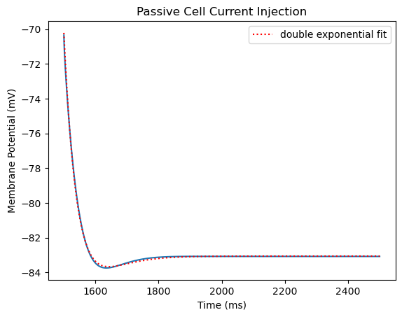
    


### Current clamp
#### Runs a current clamp on a HOC object


```python
from bmtool.singlecell import CurrentClamp
sim = CurrentClamp('Cell_Cf', inj_amp=350., inj_delay=1500., inj_dur=1000., tstop=3000., threshold=-15.)
X, Y = run_and_plot(sim, title='Current Injection', xlabel='Time (ms)',
                    ylabel='Membrane Potential (mV)', plot_injection_only=True)
plt.show()
```

    Injection location: Cell_Cf[1].soma[0](0.5)
    Recording: Cell_Cf[1].soma[0](0.5)._ref_v
    Current clamp simulation running...
    
    Number of spikes: 19
    


    
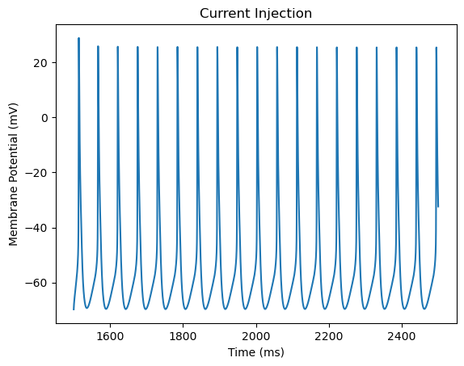
    


### FI curve
#### Calculates the frequency vs current injection plot for a HOC object


```python
from bmtool.singlecell import FI
sim = FI('Cell_Cf', i_start=0., i_stop=1000., i_increment=50., tstart=1500.,threshold=-15.)
X, Y = run_and_plot(sim, title='FI Curve', xlabel='Injection (nA)', ylabel='# Spikes')
plt.show()
```

    Injection location: Cell_Cf[21].soma[0](0.5)
    Recording: Cell_Cf[21].soma[0](0.5)._ref_v
    Running simulations for FI curve...
    
    Results
    Injection (nA): 0, 0.05, 0.1, 0.15, 0.2, 0.25, 0.3, 0.35, 0.4, 0.45, 0.5, 0.55, 0.6, 0.65, 0.7, 0.75, 0.8, 0.85, 0.9, 0.95
    Number of spikes: 0, 1, 10, 12, 15, 16, 17, 19, 20, 20, 21, 21, 22, 23, 23, 24, 25, 25, 26, 27
    


    
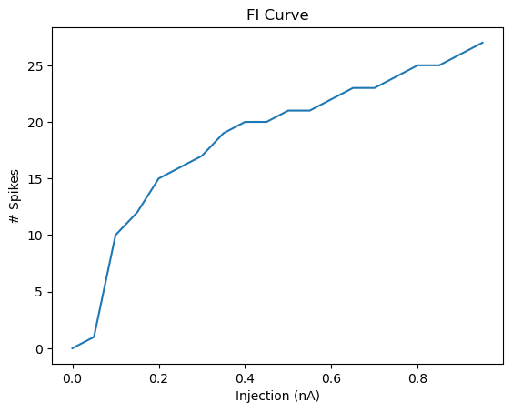
    


### ZAP
#### Runs a ZAP on a HOC object


```python
from bmtool.singlecell import ZAP
sim = ZAP('Cell_Cf')
X, Y = run_and_plot(sim)
plt.show()
```

    Injection location: Cell_Cf[22].soma[0](0.5)
    Recording: Cell_Cf[22].soma[0](0.5)._ref_v
    ZAP current simulation running...
    
    Chirp current injection with frequency changing from 0 to 15 Hz over 15 seconds
    Impedance is calculated as the ratio of FFT amplitude of membrane voltage to FFT amplitude of chirp current
    


    
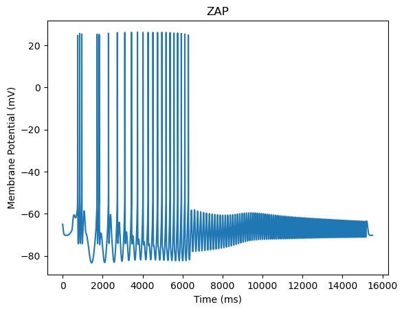
    


### Single Cell Tuning

#### From a BMTK Model directory containing a `simulation_config.json` file:
```bash
bmtool util cell tune --builder
```

#### For non-BMTK cell tuning:
```bash
bmtool util cell --template TemplateFile.hoc --mod-folder ./ tune --builder
```


### VHalf Segregation Module

#### Based on the Alturki et al. (2016) paper.

#### Segregate your channel activation for an easier time tuning your cells.


```bash
> bmtool util cell vhseg --help

Usage: bmtool util cell vhseg [OPTIONS]

  Alturki et al. (2016) V1/2 Automated Segregation Interface, simplify
  tuning by separating channel activation

Options:
  --title TEXT
  --tstop INTEGER
  --outhoc TEXT         Specify the file you want the modified cell template
                        written to
  --outfolder TEXT      Specify the directory you want the modified cell
                        template and mod files written to (default: _seg)
  --outappend           Append out instead of overwriting (default: False)
  --debug               Print all debug statements
  --fminpa INTEGER      Starting FI Curve amps (default: 0)
  --fmaxpa INTEGER      Ending FI Curve amps (default: 1000)
  --fincrement INTEGER  Increment the FI Curve amps by supplied pA (default:
                        100)
  --infvars TEXT        Specify the inf variables to plot, skips the wizard.
                        (Comma separated, eg: inf_mech,minf_mech2,ninf_mech2)
  --segvars TEXT        Specify the segregation variables to globally set,
                        skips the wizard. (Comma separated, eg:
                        mseg_mech,nseg_mech2)
  --eleak TEXT          Specify the eleak var manually
  --gleak TEXT          Specify the gleak var manually
  --othersec TEXT       Specify other sections that a window should be
                        generated for (Comma separated, eg: dend[0],dend[1])
  --help                Show this message and exit.

```

### Examples 

#### Wizard Mode (Interactive)

```bash
> bmtool util cell vhseg

? Select a cell:  CA3PyramidalCell
Using section dend[0]
? Show other sections? (default: No)  Yes
? Select other sections (space bar to select):  done (2 selections)
? Select inf variables to plot (space bar to select):   done (5 selections)
? Select segregation variables [OR VARIABLES YOU WANT TO CHANGE ON ALL SEGMENTS at the same time] (space bar to select):  done (2 selections)
```

#### Command Mode (Non-interactive)

```bash
bmtool util cell --template CA3PyramidalCell vhseg --othersec dend[0],dend[1] --infvars inf_im --segvars gbar_im --gleak gl_ichan2CA3 --eleak el_ichan2CA3
```

Example:

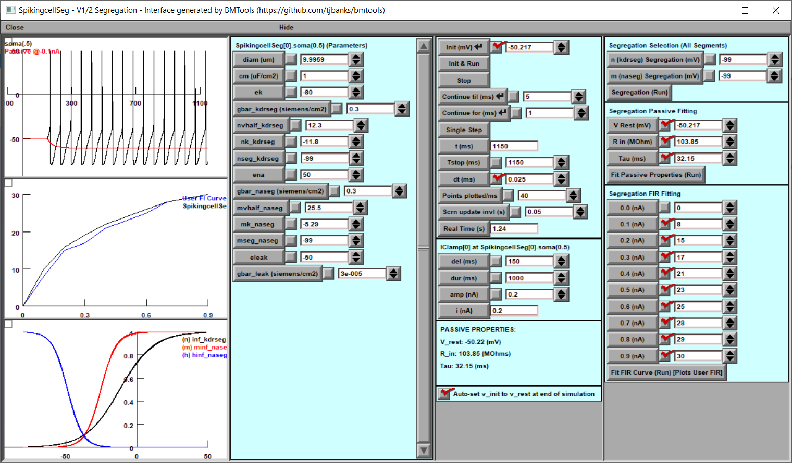

#### Simple models can utilize 
``` bash
bmtool util cell --hoc cell_template.hoc vhsegbuild --build
bmtool util cell --hoc segmented_template.hoc vhsegbuild
```
ex: [https://github.com/tjbanks/two-cell-hco](https://github.com/tjbanks/two-cell-hco)

### Connectors Module
- [UnidirectionConnector](#unidirectional-connector---unidirectional-connections-in-bmtk-network-model-with-given-probability-within-a-single-population-or-between-two-populations)
- [ReciprocalConnector](#recipical-connector---buiilding-connections-in-bmtk-network-model-with-reciprocal-probability-within-a-single-population-or-between-two-populations)
- [CorrelatedGapJunction](#correlatedgapjunction)
- [OneToOneSequentialConnector](#onetoonesequentialconnector)

#### This module contains helper functions and classes that work with BMTK's NetworkBuilder module in building networks. It facilitates building reciprocal connections, distance dependent connections, afferent connections, etc. See documentation inside the script `connectors.py` for more notes on usage.

#### All connector example below use the following network node structure
```python
from bmtk.builder import NetworkBuilder
net = NetworkBuilder('example_net')
net.add_nodes(N=100, pop_name='PopA',model_type = 'biophysical')
net.add_nodes(N=100, pop_name='PopB',model_type = 'biophysical')

background = NetworkBuilder('background')
background.add_nodes(N=300,pop_name='tON',potential='exc',model_type='virtual')
```

#### Unidirectional connector - Object for building unidirectional connections in bmtk network model with given probability within a single population (or between two populations).
```python
from bmtool.connectors  import UnidirectionConnector
connector = UnidirectionConnector(p=0.15, n_syn=1)
connector.setup_nodes(source=net.nodes(pop_name = 'PopA'), target=net.nodes(pop_name = 'PopB'))
net.add_edges(**connector.edge_params())
```
#### Recipical connector - Object for building connections in bmtk network model with reciprocal probability within a single population (or between two populations)
```python
from bmtool.connectors  import ReciprocalConnector
connector = ReciprocalConnector(p0=0.15, pr=0.06767705087, n_syn0=1, n_syn1=1,estimate_rho=False)
connector.setup_nodes(source=net.nodes(pop_name = 'PopA'), target=net.nodes(pop_name = 'PopA'))
net.add_edges(**connector.edge_params())
```
#### CorrelatedGapJunction - Object for building gap junction connections in bmtk network model with given probabilities within a single population which could be correlated with the recurrent chemical synapses in this population.
```python
from bmtool.connectors import ReciprocalConnector, CorrelatedGapJunction
connector = ReciprocalConnector(p0=0.15, pr=0.06, n_syn0=1, n_syn1=1, estimate_rho=False)
connector.setup_nodes(source=net.nodes(pop_name='PopA'), target=net.nodes(pop_name='PopA'))
net.add_edges(**connector.edge_params())
gap_junc = CorrelatedGapJunction(p_non=0.1228,p_uni=0.56,p_rec=1,connector=connector)
gap_junc.setup_nodes(source=net.nodes(pop_name='PopA'), target=net.nodes(pop_name='PopA'))
conn = net.add_edges(is_gap_junction=True, syn_weight=0.0000495, target_sections=None,afferent_section_id=0, afferent_section_pos=0.5,
**gap_junc.edge_params())
```

#### OneToOneSequentialConnector - Object for building one to one correspondence connections in bmtk network model with between two populations. One of the population can consist of multiple sub-populations.
```python
from bmtool.connectors  import OneToOneSequentialConnector
connector = OneToOneSequentialConnector()
connector.setup_nodes(source=background.nodes(), target=net.nodes(pop_name = 'PopA'))
net.add_edges(**connector.edge_params())
connector.setup_nodes(target=net.nodes(pop_name = 'PopB'))
net.add_edges(**connector.edge_params())
```

## Bmplot Module
- [Total connections](#Total-connection-plot)
- [Percent connections](#Percent-connection-plot)
- [Convergence connnections](#convergence-plot)
- [Divergence connections](#divergence-plot)
- [Gap Junction connections](#gap-junction-plot)
- [connection histogram](#connection-histogram)
- [probability connection](#probability-of-connection-plot)
- [3D location](#3d-position-plot)
- [3D rotation](#cell-rotations)
- [Plot Connection Diagram](#plot-connection-diagram)

### Total connection plot
#### Generates a table of total number of connections each neuron population recieves


```python
from bmtool import bmplot
bmplot.total_connection_matrix(config='config.json',sources='LA',targets='LA',tids='pop_name',sids='pop_name',no_prepend_pop=True,include_gap=False)
```


    
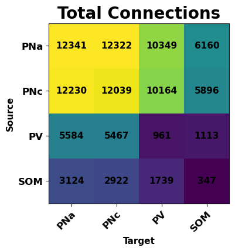
    


### Percent connection plot
#### Generates a table of the percent connectivity of neuron populations.Method can change if you want the table to be total percent connectivity, only unidirectional connectivity or only bi directional connectvity 


```python
bmplot.percent_connection_matrix(config='config.json',sources='LA',targets='LA',tids='pop_name',sids='pop_name',no_prepend_pop=True,method='total',include_gap=False)
```


    
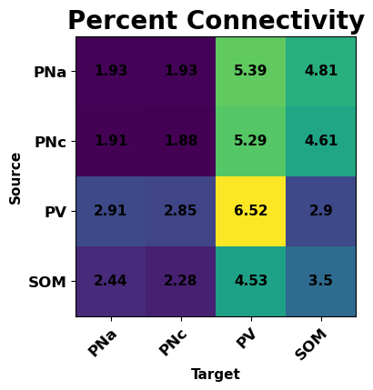
    


### Convergence plot
#### Generates a table of the mean convergence of neuron populations. Method can be changed to show max, min, mean, or std for convergence a cell recieves


```python
bmplot.convergence_connection_matrix(config='config.json',sources='LA',targets='LA',tids='pop_name',sids='pop_name',no_prepend_pop=True,include_gap=False,method='mean+std')
```


    
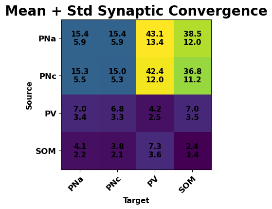
    


### Divergence plot
#### Generates a table of the mean divergence of neuron populations. Method can be changed to show max, min, mean or std divergence a cell recieves.


```python
bmplot.divergence_connection_matrix(config='config.json',sources='LA',targets='LA',tids='pop_name',sids='pop_name',no_prepend_pop=True,include_gap=False,method='mean+std')
```


    
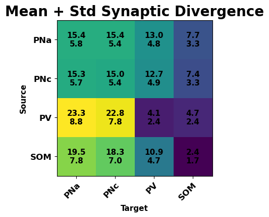
    
### Gap Junction plot
#### While gap junctions can be include in the above plots, you can use this function to only view gap junctions.Type can be either 'convergence' or 'percent' connections to generate different plots


```python
bmplot.gap_junction_matrix(config='config.json',sources='LA',targets='LA',sids='pop_name',tids='pop_name',no_prepend_pop=True,type='percent')
```


    


### Connection histogram 
#### Generates a histogram of the distribution of connections a population of cells give to individual cells of another population 


```python
bmplot.connection_histogram(config='config.json',sources='LA',targets='LA',tids='pop_name',sids='pop_name',source_cell='PV',target_cell='PV',include_gap=False)
```


    
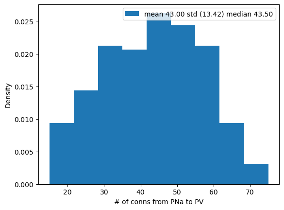
    


### probability of connection plot
#### this function needs some work


```python
bmplot.probability_connection_matrix(config='config.json',sources='LA',targets='LA',tids='pop_name',sids='pop_name',no_prepend_pop=True,line_plot=True)
```


    
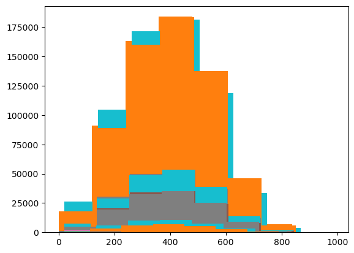
    


    

    


### 3D position plot
#### Generates a plot of cells positions in 3D space 


```python
bmplot.plot_3d_positions(config='config.json',populations_list='LA',group_by='pop_name',save_file=False)
```


    

    


### cell rotations
#### Generates a plot of cells location in 3D plot and also the cells rotation


```python
bmplot.cell_rotation_3d(config='config2.json',populations_list='all',group_by='pop_name',save_file=False,quiver_length=20,arrow_length_ratio=0.25,max_cells=100)
```


    
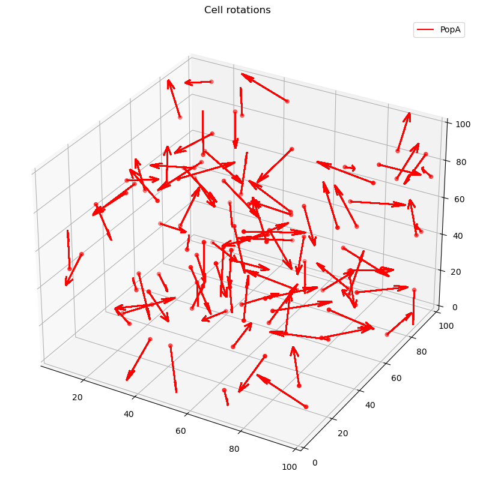
    


### Plot Connection Diagram


```python
bmplot.plot_network_graph(config='config.json',sources='LA',targets='LA',tids='pop_name',sids='pop_name',no_prepend_pop=True)
```


    
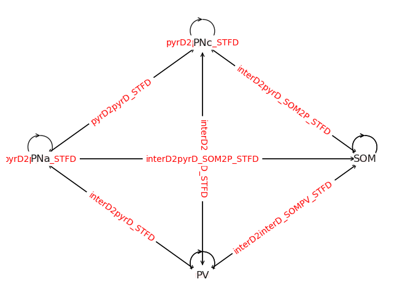
    


```python
from bmtool import bmplot
bmplot.plot_basic_cell_info(config_file='config.json')
```

    Network and node info:
    LA:


<table border="1" class="dataframe">
  <thead>
    <tr style="text-align: right;">
      <th></th>
      <th>node_type</th>
      <th>pop_name</th>
      <th>model_type</th>
      <th>model_template</th>
      <th>morphology</th>
      <th>count</th>
    </tr>
  </thead>
  <tbody>
    <tr>
      <th>0</th>
      <td>100</td>
      <td>PNa</td>
      <td>biophysical</td>
      <td>hoc:Cell_Af</td>
      <td>blank.swc</td>
      <td>800</td>
    </tr>
    <tr>
      <th>1</th>
      <td>101</td>
      <td>PNc</td>
      <td>biophysical</td>
      <td>hoc:Cell_Cf</td>
      <td>blank.swc</td>
      <td>800</td>
    </tr>
    <tr>
      <th>2</th>
      <td>102</td>
      <td>PV</td>
      <td>biophysical</td>
      <td>hoc:InterneuronCellf</td>
      <td>blank.swc</td>
      <td>240</td>
    </tr>
    <tr>
      <th>3</th>
      <td>103</td>
      <td>SOM</td>
      <td>biophysical</td>
      <td>hoc:LTS_Cell</td>
      <td>blank.swc</td>
      <td>160</td>
    </tr>
  </tbody>
</table>


    thalamus_pyr:


<table border="1" class="dataframe">
  <thead>
    <tr style="text-align: right;">
      <th></th>
      <th>node_type</th>
      <th>pop_name</th>
      <th>model_type</th>
      <th>count</th>
    </tr>
  </thead>
  <tbody>
    <tr>
      <th>0</th>
      <td>100</td>
      <td>pyr_inp</td>
      <td>virtual</td>
      <td>1600</td>
    </tr>
  </tbody>
</table>


    thalamus_pv:


<table border="1" class="dataframe">
  <thead>
    <tr style="text-align: right;">
      <th></th>
      <th>node_type</th>
      <th>pop_name</th>
      <th>model_type</th>
      <th>count</th>
    </tr>
  </thead>
  <tbody>
    <tr>
      <th>0</th>
      <td>100</td>
      <td>pv_inp</td>
      <td>virtual</td>
      <td>240</td>
    </tr>
  </tbody>
</table>


    thalamus_som:


<table border="1" class="dataframe">
  <thead>
    <tr style="text-align: right;">
      <th></th>
      <th>node_type</th>
      <th>pop_name</th>
      <th>model_type</th>
      <th>count</th>
    </tr>
  </thead>
  <tbody>
    <tr>
      <th>0</th>
      <td>100</td>
      <td>som_inp</td>
      <td>virtual</td>
      <td>160</td>
    </tr>
  </tbody>
</table>


    tone:


<table border="1" class="dataframe">
  <thead>
    <tr style="text-align: right;">
      <th></th>
      <th>node_type</th>
      <th>pop_name</th>
      <th>model_type</th>
      <th>count</th>
    </tr>
  </thead>
  <tbody>
    <tr>
      <th>0</th>
      <td>100</td>
      <td>tone</td>
      <td>virtual</td>
      <td>1840</td>
    </tr>
  </tbody>
</table>


    shock:


<table border="1" class="dataframe">
  <thead>
    <tr style="text-align: right;">
      <th></th>
      <th>node_type</th>
      <th>pop_name</th>
      <th>model_type</th>
      <th>count</th>
    </tr>
  </thead>
  <tbody>
    <tr>
      <th>0</th>
      <td>100</td>
      <td>shock</td>
      <td>virtual</td>
      <td>400</td>
    </tr>
  </tbody>
</table>


    shell:


<table border="1" class="dataframe">
  <thead>
    <tr style="text-align: right;">
      <th></th>
      <th>node_type</th>
      <th>pop_name</th>
      <th>model_type</th>
      <th>count</th>
    </tr>
  </thead>
  <tbody>
    <tr>
      <th>0</th>
      <td>100</td>
      <td>PNa</td>
      <td>virtual</td>
      <td>3975</td>
    </tr>
    <tr>
      <th>1</th>
      <td>101</td>
      <td>PNc</td>
      <td>virtual</td>
      <td>3975</td>
    </tr>
    <tr>
      <th>2</th>
      <td>102</td>
      <td>PV</td>
      <td>virtual</td>
      <td>1680</td>
    </tr>
    <tr>
      <th>3</th>
      <td>103</td>
      <td>SOM</td>
      <td>virtual</td>
      <td>1120</td>
    </tr>
  </tbody>
</table>


    'LA'
## Graphs Module
- [Generate graph](#generate-graph)
- [Plot Graph](#plot-graph)
- [Connectioon table](#generate-graph-connection-table)

### Generate Graph


```python
from bmtool import graphs
import networkx as nx

Graph = graphs.generate_graph(config='config.json',source='LA',target='LA')
print("Number of nodes:", Graph.number_of_nodes())
print("Number of edges:", Graph.number_of_edges())
print("Node labels:", set(nx.get_node_attributes(Graph, 'label').values()))
```

    Number of nodes: 2000
    Number of edges: 84235
    Node labels: {'SOM', 'PNc', 'PNa', 'PV'}


### Plot Graph
#### Generates an interactive plot showing nodes, edges and # of connections


```python
graphs.plot_graph(Graph)
```


### Generate graph connection table
#### Generates a CSV of all cells and the number of connections each individual cell receives


```python
import pandas as pd
graphs.export_node_connections_to_csv(Graph, 'node_connections.csv')
df = pd.read_csv('node_connections.csv')
df.head()
```


<div>
<style scoped>
    .dataframe tbody tr th:only-of-type {
        vertical-align: middle;
    }

    .dataframe tbody tr th {
        vertical-align: top;
    }

    .dataframe thead th {
        text-align: right;
    }
</style>
<table border="1" class="dataframe">
  <thead>
    <tr style="text-align: right;">
      <th></th>
      <th>Unnamed: 0</th>
      <th>Node Label</th>
      <th>PNc Connections</th>
      <th>PV Connections</th>
      <th>SOM Connections</th>
      <th>PNa Connections</th>
    </tr>
  </thead>
  <tbody>
    <tr>
      <th>0</th>
      <td>0</td>
      <td>PNa</td>
      <td>15</td>
      <td>11</td>
      <td>9</td>
      <td>6</td>
    </tr>
    <tr>
      <th>1</th>
      <td>1</td>
      <td>PNa</td>
      <td>24</td>
      <td>25</td>
      <td>6</td>
      <td>21</td>
    </tr>
    <tr>
      <th>2</th>
      <td>2</td>
      <td>PNa</td>
      <td>27</td>
      <td>28</td>
      <td>12</td>
      <td>25</td>
    </tr>
    <tr>
      <th>3</th>
      <td>3</td>
      <td>PNa</td>
      <td>19</td>
      <td>27</td>
      <td>15</td>
      <td>35</td>
    </tr>
    <tr>
      <th>4</th>
      <td>4</td>
      <td>PNa</td>
      <td>25</td>
      <td>11</td>
      <td>8</td>
      <td>16</td>
    </tr>
  </tbody>
</table>
</div>


