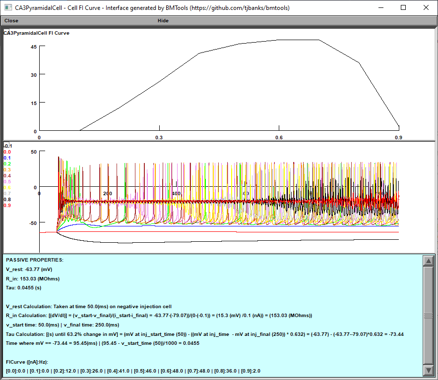

# bmtools
A collection of scripts to make developing networks in BMTK easier.

[](https://github.com/tjbanks/bmtool/blob/master/LICENSE) 

## Getting Started

**Installation**

```bash
pip install bmtool
```
For developers who will be pulling down additional updates to this repository regularly use the following instead.
```bash
git clone https://github.com/tjbanks/bmtools
cd bmtools
python setup.py develop
```
Then download updates (from this directory) with
```
git pull
```

**Example Use**

```bash
> cd your_bmtk_model_directory
> bmtools
Usage: bmtools [OPTIONS] COMMAND [ARGS]...

Options:
  --verbose  Verbose printing
  --help     Show this message and exit.

Commands:
  debug
  plot
  util

>  
> bmtools plot 
Usage: bmtools plot [OPTIONS] COMMAND [ARGS]...

Options:
  --config PATH  Configuration file to use, default: "simulation_config.json"
  --no-display   When set there will be no plot displayed, useful for saving
                 plots
  --help         Show this message and exit.

Commands:
  connection  Display information related to neuron connections
  positions   Plot cell positions for a given set of populations
  raster      Plot the spike raster for a given population
  report      Plot the specified report using BMTK's default report plotter
>
> bmtools plot positions
```


### Single Cell Tuning

From a BMTK Model directory containing a `simulation_config.json` file:
```
bmtools util cell tune --builder
```

For non-BMTK cell tuning:
```
bmtools util cell --template TemplateFile.hoc --mod-folder ./ tune --builder
```


### FIR Curve plotting

```
> bmtools util cell fir --help
Usage: bmtools util cell fir [OPTIONS]

  Creates a NEURON GUI window with FI curve and passive properties

Options:
  --title TEXT
  --min-pa INTEGER   Min pA for injection
  --max-pa INTEGER   Max pA for injection
  --increment FLOAT  Increment the injection by [i] pA
  --tstart INTEGER   Injection start time
  --tdur INTEGER     Duration of injection default:1000ms
  --advanced         Interactive dialog to select injection and recording
                     points
  --help             Show this message and exit.

> bmtools util cell fir
? Select a cell:  (Use arrow keys)
 » CA3PyramidalCell
   DGCell
   IzhiCell
   IzhiCell_BC
   IzhiCell_EC
   IzhiCell_EC2
   IzhiCell_EC_BIO
   IzhiCell_EmoExcitatory
   IzhiCell_EmoInhibitory
   IzhiCell_OLM
   IzhiCell_int
```



### VHalf Segregation Module

Based on the Alturki et al. (2016) paper.

Segregate your channel activation for an easier time tuning your cells.


```
> bmtools util cell vhseg --help

Usage: bmtools util cell vhseg [OPTIONS]

  Alturki et al. (2016) V1/2 Automated Segregation Interface, simplify
  tuning by separating channel activation

Options:
  --title TEXT
  --tstop INTEGER
  --outhoc TEXT         Specify the file you want the modified cell template
                        written to
  --outfolder TEXT      Specify the directory you want the modified cell
                        template and mod files written to (default: _seg)
  --outappend           Append out instead of overwriting (default: False)
  --debug               Print all debug statements
  --fminpa INTEGER      Starting FIR Curve amps (default: 0)
  --fmaxpa INTEGER      Ending FIR Curve amps (default: 1000)
  --fincrement INTEGER  Increment the FIR Curve amps by supplied pA (default:
                        100)
  --infvars TEXT        Specify the inf variables to plot, skips the wizard.
                        (Comma separated, eg: inf_mech,minf_mech2,ninf_mech2)
  --segvars TEXT        Specify the segregation variables to globally set,
                        skips the wizard. (Comma separated, eg:
                        mseg_mech,nseg_mech2)
  --eleak TEXT          Specify the eleak var manually
  --gleak TEXT          Specify the gleak var manually
  --othersec TEXT       Specify other sections that a window should be
                        generated for (Comma separated, eg: dend[0],dend[1])
  --help                Show this message and exit.

```

#### Examples 

Wizard Mode (Interactive)

```
> bmtool util cell vhseg

? Select a cell:  CA3PyramidalCell
Using section dend[0]
? Show other sections? (default: No)  Yes
? Select other sections (space bar to select):  done (2 selections)
? Select inf variables to plot (space bar to select):   done (5 selections)
? Select segregation variables [OR VARIABLES YOU WANT TO CHANGE ON ALL SEGMENTS at the same time] (space bar to select):  done (2 selections)
```

Command Mode (Non-interactive)

```
bmtool util cell --template CA3PyramidalCell vhseg --othersec dend[0],dend[1] --infvars inf_im --segvars gbar_im --gleak gl_ichan2CA3 --eleak el_ichan2CA3
```

Example:


Simple models can utilize 
``` 
bmtool util cell --hoc cell_template.hoc vhsegbuild --build
bmtool util cell --hoc segmented_template.hoc vhsegbuild
```
ex: [https://github.com/tjbanks/two-cell-hco](https://github.com/tjbanks/two-cell-hco)

## Planned future features
```
bmtools build
    Create a starting point network
    Download sample networks

bmtools plot
    Plot variable traces
    Plot spike rasters
    X Plot cell positions
    X Plot connection matricies
    
bmtools debug 
    X list cell types available for single debug
    X Run a single cell in the network
    Isolate a single cell in the network
```
