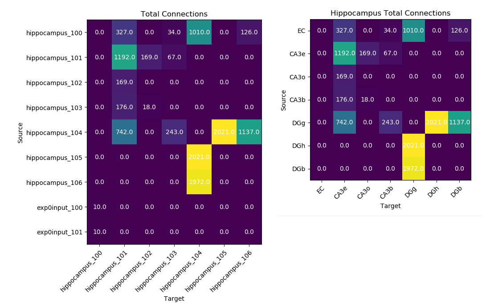
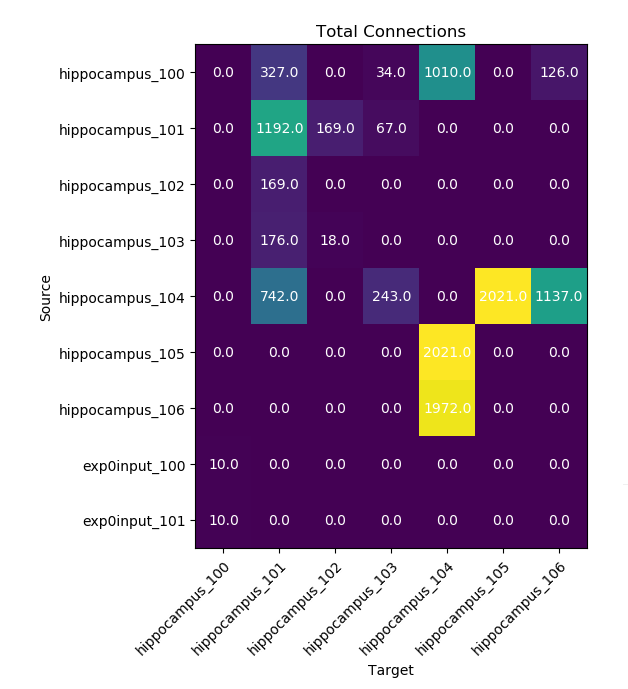
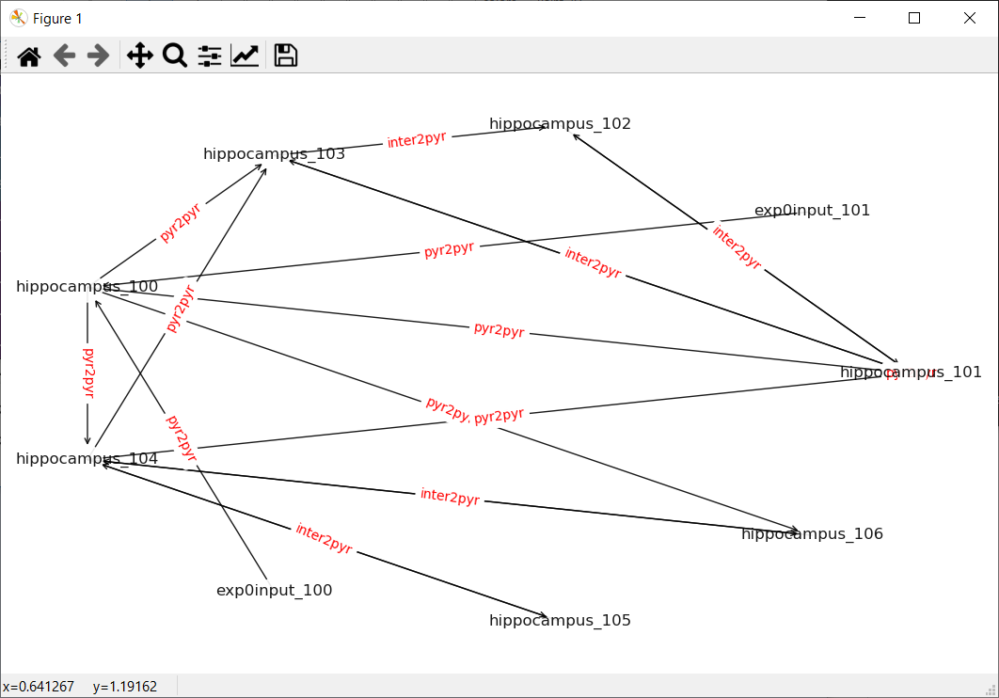
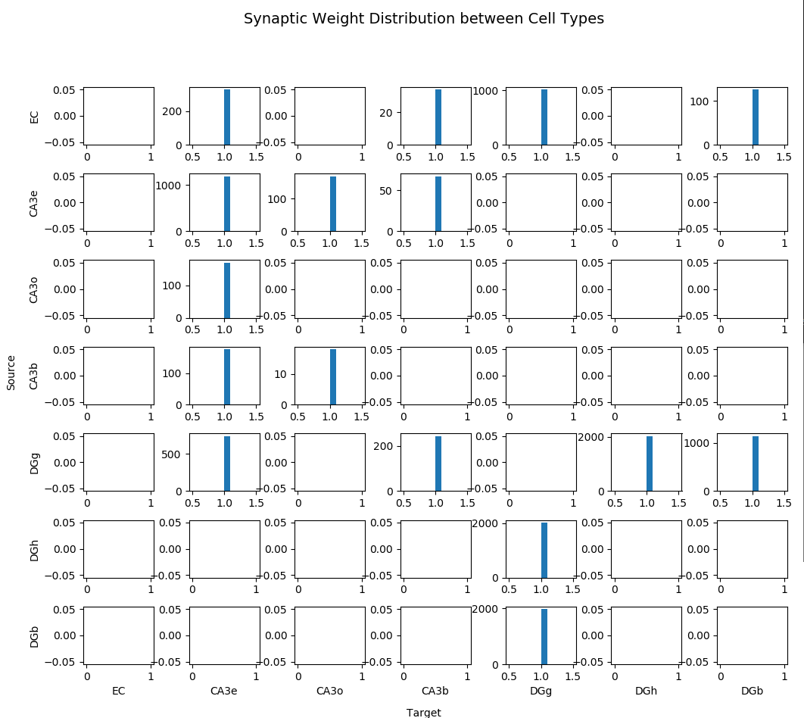
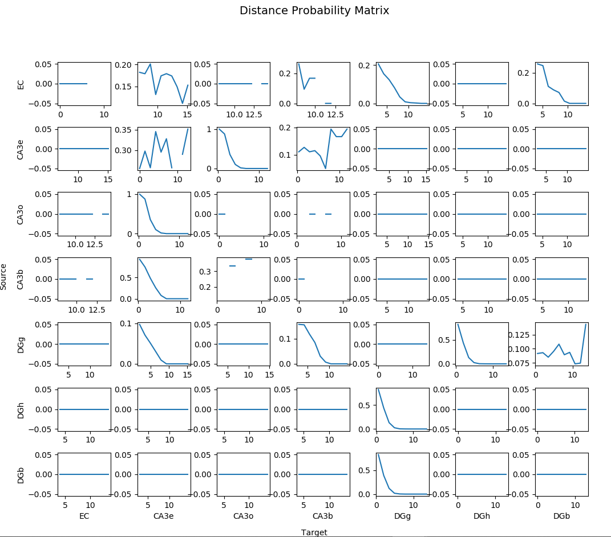
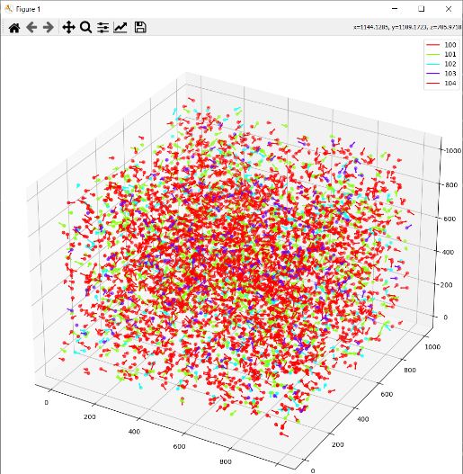
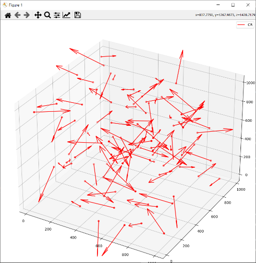

# bmtool
A collection of scripts to make developing networks in BMTK easier.

[](https://github.com/tjbanks/bmtool/blob/master/LICENSE) 

## Getting Started

**Installation**

```bash
pip install bmtool
```
For developers who will be pulling down additional updates to this repository regularly use the following instead.
```bash
git clone https://github.com/tjbanks/bmtool
cd bmtool
python setup.py develop
```
Then download updates (from this directory) with
```
git pull
```

**Example Use**

```bash
> cd your_bmtk_model_directory
> bmtool
Usage: bmtool [OPTIONS] COMMAND [ARGS]...

Options:
  --verbose  Verbose printing
  --help     Show this message and exit.

Commands:
  debug
  plot
  util

>  
> bmtool plot 
Usage: bmtool plot [OPTIONS] COMMAND [ARGS]...

Options:
  --config PATH  Configuration file to use, default: "simulation_config.json"
  --no-display   When set there will be no plot displayed, useful for saving
                 plots
  --help         Show this message and exit.

Commands:
  connection  Display information related to neuron connections
  positions   Plot cell positions for a given set of populations
  raster      Plot the spike raster for a given population
  report      Plot the specified report using BMTK's default report plotter
>
> bmtool plot positions
```


## Plotting Configuration

BMTool utilizes the default `simulation-config.json` file to know which data files built by BMTK to read. to change this, specify the config after the `plot` command. Eg:

```
bmtool plot --config simulation-config-23.json [FUNCTION] 
```

### From python or Jupyter
```
from bmtool import bmplot
bmplot.plot_3d_positions(config="simulation_config.json")
```

## Ploting Connections

All connection tools can be customized by supplying additional arguments. 

```
Options:
  --title TEXT      change the plot's title
  --save-file TEXT  save plot to path supplied
  --sources TEXT    comma separated list of source node types [default:all]
  --targets TEXT    comma separated list of target node types [default:all]
  --sids TEXT       comma separated list of source node identifiers
                    [default:node_type_id]
  --tids TEXT       comma separated list of target node identifiers
                    [default:node_type_id]
  --no-prepend-pop  When set don't prepend the population name to the unique
                    ids [default:False]
```

#### `--sources`  and `--targets`
Are supplied as comma separated lists and corrospond with the population name specified in your model. Eg:
```
#initialize the networks in build_network.py
net = NetworkBuilder('hippocampus')
exp0net = NetworkBuilder('exp0input')
```
Default behavior is to plot connections between all populations but you can specify only a few to simplify your plots.

#### `--sids` and `--tids`
Comma separated lists of node identifiers replace the default `cell_id` automatically given to a cell population by BMTK. Any parameter passed to `NetworkBuilder.add_nodes` is stored in network `.h5` files and can be used to identify cells while connecting or producing plots. Eg:

```
# Adding nodes in build_network.py
net.add_nodes(N=inpTotal, pop_name='EC',
    positions=p_EC,
    model_type='biophysical',
    model_template='hoc:IzhiCell_EC2',
    morphology='blank.swc'
    )
```
We could then use the pop_name to alter the output of our connection plots.

```
bmtool plot connection --sids pop_name --tids pop_name [FUNCTION]
```
#### `--no-prepend-pop`

Default behavior of bmtool is to print the population name before the cell id (or sid/tid) followed by an underscore. Eg: `hippocampus_100`. By supplying `--no-prepend-pop` the cell name becomes `100` unless specified otherwise.

#### `All together basic`

Using these optional switches we can see the difference in our plot output below.

Command line
```
bmtool plot connection total
```
Python or Jupyter Notebook
```
from bmtool import bmplot
import matplotlib.pyplot as plt

bmplot.connection_matrix(config="simulation_config.json")
```

#### `All together advanced`
```
bmtool plot connection --sources hippocampus --targets hippocampus --sids pop_name --tids pop_name --no-prepend-pop --title 'Hippocampus Total Connections' total
```

Python or Jupyter Notebook
```
from bmtool import bmplot

bmplot.connection_matrix(config="simulation_config.json", sources="hippocampus", targets="hippocampus", sids="pop_name", tids="pop_name", no_prepend_pop=True, title="Hippocampus Total Connections")
```



### Plot Total Connections

To plot the total number of connections between two populations of cells run 

Command line
```
bmtool plot connection total
```
Python or Jupyter Notebook
```
from bmtool import bmplot

bmplot.connection_matrix(config="simulation_config.json", sources="hippocampus", targets="hippocampus")
```
Remember to customize the output using the instructions above.

#### `--synfo`
This is an additional flag that can be used in the total connections plot. By default it is set to '0' which plots total connections. 
If it is specified as '1', it plots the mean and standard deviation number of connections. If it is '2', it plots the .mod files used for that connection type.
Finally if it is '3', it plots the parameter file (.json) used for the connection.



### Plot Average Convergence/Divergence

To plot the average convergence or divergence of a single cell excute one of the following commands:

Command Line
```
bmtool plot connection convergence
bmtool plot connection divergence

Add --method (std, min, or max) for additional function
```

Python or Jupyter Notebook
```
from bmtool import bmplot

bmplot.convergence_connection_matrix(config="simulation_config.json")
bmplot.divergence_connection_matrix(config="simulation_config.json")

# OR using methods (min,max,std)
bmplot.convergence_connection_matrix(config="simulation_config.json", method="min")
```


### Plot Connection Diagram

To plot a rough sketch of cell type connectivity and the type of synapse used between cells run:

Command Line
```
bmtool plot connection network-graph
```

Python or Jupyter Notebook
```
from bmtool import bmplot

bmplot.plot_network_graph(config="simulation_config.json")
```




`--edge-property` is an option available to change the synapse name if supplied to `NetworkBuilder.add_edges` when building the network. Default: `model_template`

### Edge Property Histograms

To view the distribution of an edge property between cell types run:

Command Line
```
bmtool plot connection property-histogram-matrix
```

Python or Jupyter Notebook
```
from bmtool import bmplot

bmplot.edge_histogram_matrix(config="simulation_config.json")
```

The following figure was generated using 
```
bmtool plot connection --sources hippocampus --targets hippocampus --sids pop_name --tids pop_name --no-prepend-pop --title 'Synaptic Weight Distribution between Cell Types' property-histogram-matrix
```

```
from bmtool import bmplot

bmplot.edge_histogram_matrix(config="simulation_config.json", sources="hippocampus", targets="hippocampus", sids="pop_name", tids="pop_name", no_prepend_pop=True, title="Synaptic Weight Distribution between Cell Types")
```



By default the `property-histogram-matrix` looks at the `syn_weight` value specified in the `NetworkBuilder.add_edges` function when building your network. You can change this by specifying the `--edge-property`. Eg: 
```
bmtool plot connection property-histogram-matrix --edge-property [PROPERTY]
```

#### Plotting edge values during/after runtime

BMTool is capable of plotting connection properties obtained after runtime from reports. This is useful for synaptic weights that change over time. 

First, you must explicitly record the connection property in your `simulation_config.json`

```
  "reports": {
    "syn_report": {
      "cells": "hippocampus",
      "variable_name": "W_nmda",
      "module": "netcon_report",
      "sections": "soma",
      "syn_type": "pyr2pyr",
      "file_name": "syns.h5"
    }
  }
```
Where `pyr2pyr` is the `POINT_PROCESS` name for the synapse you're attempting to record, and the `variable_name` is a `RANGE` variable listed int the `NEURON` block of the synapse `.mod` file.

Once the simulation has been run un the following referencing the report specified above:

```
bmtool plot connection property-histogram-matrix --edge-property pyr2pyr_w --report output/syns.h5 --time 9999
```

The `--time-compare` option can be be used to show the weight distribution change between the specified times. Eg: ` --time 0 --time-compare 10000`

See the [BMTK Commit](https://github.com/AllenInstitute/bmtk/pull/67/files) for more details.

### Plotting Distance Probability Matrix between cell types



To show the probability of a cell type being connected to another cell type based on distance run:

```
bmtool plot connection prob
```

Full summary of options:

```
> bmtool plot connection prob --help
Usage: bmtool plot connection prob [OPTIONS]

  Probabilities for a connection between given populations. Distance and
  type dependent

Options:
  --axis TEXT  comma separated list of axis to use for distance measure eg:
               x,y,z or x,y
  --bins TEXT  number of bins to separate distances into (resolution) -
               default: 8
  --line       Create a line plot instead of a binned bar plot
  --verbose    Print plot values for use in another script
  --help       Show this message and exit.
```

A more complete command (used for image above) may look similar to

```
bmtool plot connection --sources hippocampus --targets hippocampus --no-prepend-pop --sids pop_name --tids pop_name prob --bins 10 --line --verbose
```

This will plot cells in the `hippocampus` network, using the `pop_name` as the cell identifier. There will be `10` bins created to group the cell distances. A `line` plot will be generated instead of the default `bar` chart. All values for each plot will be printed to the console due to the `verbose` flag.

All  `point_process` cell types will be ignored since they do not have physical locations.

### Plot 3d cell location and rotation
Plot the location and rotation of your cells. Plot all of your cells with a single command
```
bmtool plot cell rotation
```


Customize your plot by limiting the cells you want or selecting a max number of cells to plot.
```
bmtool plot --config simulation_configECP.json cell rotation --group-by pop_name --group CR --max-cells 100 --quiver-length 100 --arrow-length-ratio 0.25
```


Code
```
from bmtool import
from bmtool import bmplot

bmplot.cell_rotation_3d(config=config,
                     populations=populations,
                     group_by=group_by,
                     group=group,
                     title=title,
                     max_cells=max_cells,
                     quiver_length=quiver_length,
                     arrow_length_ratio=arrow_length_ratio)
```

### Plotting Current Clamp and Spike Train Info
To plot all current clamp info involved in a simulation, use the following command (uses 'simulation_config.json' as default)
```
bmtool plot --config simulation_config_foo.json iclamp
```

To plot all spike trains and their target cells,
```
bmtool plot --config simulation_config_foo.json input
```

### Printing basic cell information involved in a simulation
```
bmtool plot --config simulation_config_foo.json cells
```

### Simulation Summary

Using previous functions, plots connection probability as a function of distance, total connections, cell information, current clamp information, input spike train information, and a 3D plot of the network if specified. 
```
bmtool plot --config simulation_config_foo.json summary
```

### Connectors Module

This module contains helper functions and classes that work with BMTK's NetworkBuilder module in building networks. It facilitates building reciprocal connections, distance dependent connections, afferent connections, etc. See documentation inside the script `connectors.py` for usage.
```
from bmtool import connectors
```

## Cell Tuning

### Python/Jupyter

Single Cell Profiler

```
from bmtool.singlecell import Profiler

#Example usage
profiler = Profiler(template_dir='./components/templates', mechanism_dir='./components/mechanisms/modfiles')
profiler.passive_properties('Cell_Cf')
profiler.fi_curve('Cell_Cf')
profiler.current_injection('Cell_Cf', post_init_function="insert_mechs(123)", inj_amp=300, inj_delay=100)
```

### Single Cell Tuning

From a BMTK Model directory containing a `simulation_config.json` file:
```
bmtool util cell tune --builder
```

For non-BMTK cell tuning:
```
bmtool util cell --template TemplateFile.hoc --mod-folder ./ tune --builder
```


### FIR Curve plotting

```
> bmtool util cell fi --help
Usage: bmtool util cell fi [OPTIONS]

  Creates a NEURON GUI window with FI curve and passive properties

Options:
  --title TEXT
  --min-pa INTEGER   Min pA for injection
  --max-pa INTEGER   Max pA for injection
  --increment FLOAT  Increment the injection by [i] pA
  --tstart INTEGER   Injection start time
  --tdur INTEGER     Duration of injection default:1000ms
  --advanced         Interactive dialog to select injection and recording
                     points
  --help             Show this message and exit.

> bmtool util cell fi
? Select a cell:  (Use arrow keys)
 » CA3PyramidalCell
   DGCell
   IzhiCell
   IzhiCell_BC
   IzhiCell_EC
   IzhiCell_EC2
   IzhiCell_EC_BIO
   IzhiCell_EmoExcitatory
   IzhiCell_EmoInhibitory
   IzhiCell_OLM
   IzhiCell_int
```


### VHalf Segregation Module

Based on the Alturki et al. (2016) paper.

Segregate your channel activation for an easier time tuning your cells.


```
> bmtool util cell vhseg --help

Usage: bmtool util cell vhseg [OPTIONS]

  Alturki et al. (2016) V1/2 Automated Segregation Interface, simplify
  tuning by separating channel activation

Options:
  --title TEXT
  --tstop INTEGER
  --outhoc TEXT         Specify the file you want the modified cell template
                        written to
  --outfolder TEXT      Specify the directory you want the modified cell
                        template and mod files written to (default: _seg)
  --outappend           Append out instead of overwriting (default: False)
  --debug               Print all debug statements
  --fminpa INTEGER      Starting FI Curve amps (default: 0)
  --fmaxpa INTEGER      Ending FI Curve amps (default: 1000)
  --fincrement INTEGER  Increment the FI Curve amps by supplied pA (default:
                        100)
  --infvars TEXT        Specify the inf variables to plot, skips the wizard.
                        (Comma separated, eg: inf_mech,minf_mech2,ninf_mech2)
  --segvars TEXT        Specify the segregation variables to globally set,
                        skips the wizard. (Comma separated, eg:
                        mseg_mech,nseg_mech2)
  --eleak TEXT          Specify the eleak var manually
  --gleak TEXT          Specify the gleak var manually
  --othersec TEXT       Specify other sections that a window should be
                        generated for (Comma separated, eg: dend[0],dend[1])
  --help                Show this message and exit.

```

#### Examples 

Wizard Mode (Interactive)

```
> bmtool util cell vhseg

? Select a cell:  CA3PyramidalCell
Using section dend[0]
? Show other sections? (default: No)  Yes
? Select other sections (space bar to select):  done (2 selections)
? Select inf variables to plot (space bar to select):   done (5 selections)
? Select segregation variables [OR VARIABLES YOU WANT TO CHANGE ON ALL SEGMENTS at the same time] (space bar to select):  done (2 selections)
```

Command Mode (Non-interactive)

```
bmtool util cell --template CA3PyramidalCell vhseg --othersec dend[0],dend[1] --infvars inf_im --segvars gbar_im --gleak gl_ichan2CA3 --eleak el_ichan2CA3
```

Example:


Simple models can utilize 
``` 
bmtool util cell --hoc cell_template.hoc vhsegbuild --build
bmtool util cell --hoc segmented_template.hoc vhsegbuild
```
ex: [https://github.com/tjbanks/two-cell-hco](https://github.com/tjbanks/two-cell-hco)

